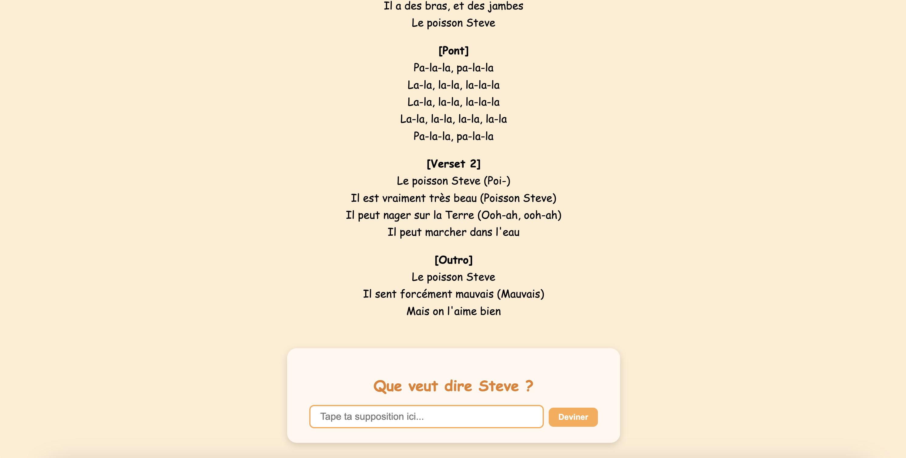
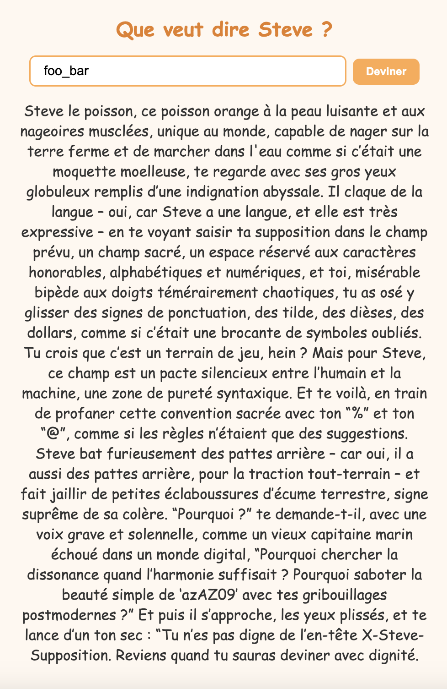

問題文に記されているサイトにアクセスすると、Le Poisson Steveの動画（かわいい）が流れた後、"Que veut dire Steve? (スティーブってどういう意味かな？)"という質問とともに入力フォームが表示される。



"foo"のような適当な文字列を入力すると"Bah, tu as tort.（それは違うよ）"と返ってくる。

さらに、"foo_bar"のような記号を含む文字列を入力すると、ものすごい長文で怒られる。



ソースコードが配布されているので覗いてみる。

[index.js](./index.js)

まず注目すべきは73行目。`flag`テーブルに対してSQLクエリを発行しているが、プリペアドステートメント等の対策をせず、リクエストヘッダー`x-steve-supposition`の値をそのまま埋め込んでいる。`x-steve-supposition`に悪意のある文字列を乗せれば、SQLインジェクションを引き起こせる。

```javascript
    // 📋 Exécution d'une requête SQL : on cherche si la supposition de Steve est correcte
    const rows = await db.all(`SELECT * FROM flag WHERE value = '${req.get("x-steve-supposition")}'`);
```

しかし、`x-steve-supposition`に自由に値を乗せることはできない。なぜなら、その手前で厳重なバリデーションが施されているからだ。
具体的には、for文によって各ヘッダーのチェックが行われ、`x-steve-supposition`ヘッダーが発見されると、それが変数`steveHeaderValue`に入れられる。

```javascript
        // 🔮 Si on trouve l’en-tête "X-Steve-Supposition", on le garde
        if (headerName.toLowerCase() === 'x-steve-supposition') {
            steveHeaderValue = headerValue;
        } 
```

その後、`steveHeaderValue`のバリデーションが行われる。英数字と`{}`以外の文字が入っている場合、この時点で処理が終了してしまう。先ほど`foo_bar`を入力すると長文で叱られたのは、ここに引っかかっていたということだ。

```javascript
    // 🧪 Validation de la structure de la supposition : uniquement des caractères honorables
    if (!/^[a-zA-Z0-9{}]+$/.test(steveHeaderValue)) {
        return res.status(403).send(`Steve le poisson, ce poisson orange à la peau luisante et aux nageoires musclées, unique au monde, capable de nager sur la terre ferme et de marcher dans l'eau comme si c’était une moquette moelleuse, te regarde avec ses gros yeux globuleux remplis d’une indignation abyssale ...（省略）)`);
    }
```

この時点で考えられる方針は以下。

1. 英数字と`{}`だけの入力でSQLインジェクションを引き起こす。
2. 何らかの方法でヘッダーのバリデーションを回避し、SQLインジェクションを引き起こす。
3. SQLインジェクション以外の方法でflagを取る。

実装自体はSQLインジェクションしてくださいと言わんばかりの書き方になっているので、3を検討するのは後でいいだろう。とはいっても1は流石に厳しそうなので、2の方針を考えることになる。
ソースコードを見ると、上に挙げたもの以外にも、リクエストヘッダーに様々なバリデーションが施されている。少々過剰なバリデーションが逆に怪しいので、ヘッダー周りで何か弄ると良さそうである。

これを踏まえて改めて実装を見ると、`steveHeaderValue`の扱いが鍵であることに気づく。`headerName.toLowerCase() === 'x-steve-supposition'`という条件を満たす場合、`steveHeaderValue`に値が入るわけだが、仮にこの条件を満たすものが**複数**存在した場合、前にチェックした値は後でチェックした値に上書きされてしまう。

よって、例えば以下のようなリクエストを送った場合、`steveHeaderValue`には最終的に`foo`が入るのでバリデーションは突破するが、SQLには悪意のある値を埋め込むことが可能である。

```shell
curl 'https://steve-le-poisson-api.challs.umdctf.io/deviner' \
  -H 'accept: */*' \
  (中略)
  -H 'x-steve-supposition: {悪意のある値}'
  -H 'X-STEVE-SUPPOSITION: foo'
```

SQLに任意の文字列を埋め込めるなら、後はブラインドSQLインジェクションによってflagを特定可能である。例えば`' OR (LENGTH((SELECT value FROM flag LIMIT 1)) > 20) --`のような値を入れることで、二分探索的にflagの文字列長を特定できるし、`' OR (SUBSTR((SELECT value FROM flag LIMIT 1), 1, 1) = 'U') --`のような値を入れて全探索することによって、flagの中の特定の位置の文字が何かを特定できる。
pythonで実装すると以下のようになる（ちなみに、pythonのrequestsライブラリはヘッダーの重複を許容していないらしい？ため、curlコマンドを直接実行する実装を採用している）。

[attack.py](./attack.py)

得られるflagは以下。これを元の入力フォームに入れてあげると、"Tu as raison! (正解！)"と表示される。

`UMDCTF{ile5TVR4IM3NtTresbEAu}`
